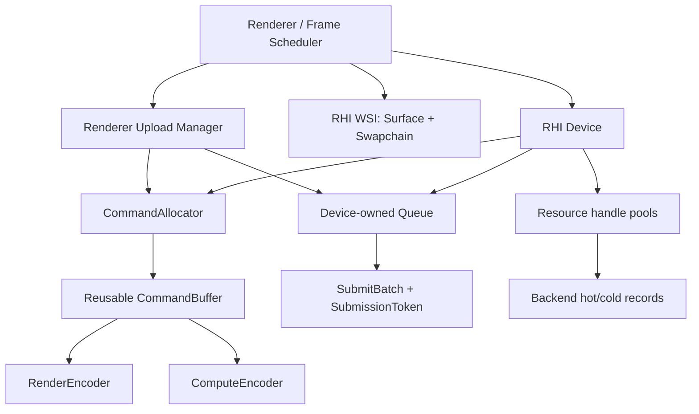
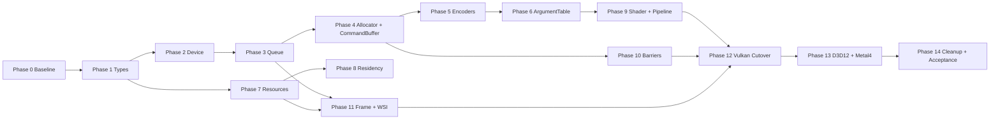

# RHI 公共契约重大重构任务清单

## 实施与验收状态

截至 2026-08-06，公共 RHI 主干、Vulkan 生产后端以及限定于 `--no-post --no-ddgi` 的 D3D12 scoped runtime 已在 Windows x64 Debug 配置完成实施与本机验收。当前任务清单共 275 项，已勾选 268 项、未勾选 7 项；未完成项仅涉及不可追溯的重构前性能计数基线和需要远端 Windows/macOS 环境的外部验收。最终运行与视觉证据统一绑定到以下 canonical executable，旧的 `*-accepted`、`*-final-accepted`、`current-20260806` 与诊断目录仅保留调查价值，不作为最终验收依据：

- 可执行文件：`out/build/x64-debug/Demo.exe`
- SHA-256：`308006861ee6152d8169dd91482b81ff6577cf7a1d3aad246c7d3de5ff0fbae0`
- Vulkan：完整且经过验证的基线后端；Debug 构建启用 Vulkan Validation Layer。
- D3D12：完成计划外扩展的 scoped runtime backend，已覆盖 GPU-driven、`--no-post --no-ddgi` 路径；Debug 构建启用 D3D12 Debug Layer。
- Metal 4：仅标记为 `contract-shaped`，不宣称 backend complete。

| Phase | 已勾选 | 当前判定 |
|---|---:|---|
| Phase 0-12 | `218/220` | 实施与本机验收完成；仅缺重构前 hot-path/performance counter 基线及据此进行的逐 phase 对比 |
| Phase 13 | `14/17` | D3D12 本机构建与 scoped runtime 已验证；Metal 4 为 `contract-shaped`；远端 Windows CI run artifact 和 macOS/Xcode 编译运行证据待外部补齐 |
| Phase 14 | `36/38` | 本机功能、视觉、soak 和 hot-path counter 验收完成；Metal 4 macOS 最终证据和依赖历史基线的定量回归阈值待外部补齐 |
| 合计 | `268/275` | `locally-accepted; external-evidence-pending` |

| 验收项 | 结果 | Canonical 证据 |
|---|---:|---|
| 重构前 Vulkan 基线 | 已落盘 | `captures/rhi-public-contract-refactor/phase0/vulkan-before/` |
| Debug 全量构建 | 通过且为当前产物 | `build_debug_with_vsdevcmd.cmd` |
| CTest | `12/12` | canonical build test output |
| Python contracts | `263/263` | repository contract suite |
| 公共边界 ratchet | `backend_include 0/0`、`vk_token 0/0`、`native_getter 0/0` | `tools/check_rhi_boundary.py` |
| 严格边界检查 | `blocking_findings: 0` | `.planning/guards/rhi-boundary-report.json` |
| Vulkan/D3D12 runtime soak | 两后端均通过；resize/minimize/restore，退出码 0，debug/validation 命中 0 | `captures/rhi-public-contract-refactor/final/current-20260806-30800686/runtime/window-resize-soak-report.json` |
| 稳定窗口指标 | Vulkan CPU/GPU `2.357934/1.534305 ms`；D3D12 `2.211850/1.314455 ms`；两后端 stable recording budget 通过 | `captures/rhi-public-contract-refactor/final/current-20260806-30800686/runtime/*-metrics-final.json` |
| hot-path counters | 两后端稳定窗口 descriptor allocation、table version allocation、pipeline/layout/view creation、recording heap/native allocation 均为 `0` | `captures/rhi-public-contract-refactor/final/current-20260806-30800686/runtime/*-metrics-final.json` |
| RenderDoc 严格对比 | 6/6 framebuffer 对；`threshold=0`、每对 `diff_pixels=0` | `captures/rhi-public-contract-refactor/final/current-20260806-30800686/comparison/comparison-report.json` |
| RenderDoc capture clean | 12/12；`min-severity=medium`、message count 0 | `captures/rhi-public-contract-refactor/final/current-20260806-30800686/comparison/capture-clean/` |
| settled PNG | Vulkan 与 D3D12 字节一致，SHA-256 均为 `8b7c9fb7eb1995a067863c299dc832f901e08805c36f4f9006e1e573becad1a1` | `captures/rhi-public-contract-refactor/final/current-20260806-30800686/comparison/*-translate-settled.png` |

剩余 7 项分为三类：Phase 0 的重构前 hot-path/performance counter 未 instrument，不能事后补造；Phase 13/14 仍缺远端 Windows CI run artifact 与真实 macOS/Xcode Objective-C++ 编译和 runtime smoke；Phase 14 因缺少历史计数基线，不能执行“超过约定阈值则定位 phase”的定量回归判断。严格边界报告仍包含 38 个 `Info/hot-path-risk` 信息项，但 `blocking_findings=0`。Metal 4 只声明 `contract-shaped`，不声明 backend complete。

`vulkan-final/release-gate-report.json` 是额外运行的非 canonical CSM 资源语义诊断，复现了 Phase 0 已记录的 `--no-post` 捕获仍包含 `GPUDrivenTAAResolvePass` 的既有契约不一致；其 `pairs=0` 不是 framebuffer 差异。两份正式 manifest 的 formal capture-set gate 均通过，RHI 最终验收以本目录的 6/6 strict framebuffer、12/12 capture-clean 和 `comparison-report.json: passed=true` 为准。

## 1. 目标

本次重构不是把 Vulkan API 换一套名字，也不是为 D3D12、Metal 4 分别复制一套接口。目标是建立一个足够薄、语义明确、热路径可预测的公共 RHI：

- 公共层只表达跨 Vulkan、D3D12、Metal 4 都成立的 GPU 概念和行为。
- Vulkan/D3D12/Metal 的枚举、原生句柄、内存对象和辅助策略全部留在后端。
- `Device` 回归设备、能力和资源工厂，不再承担上传、逐帧调度、提交、回收等所有职责。
- `Queue`、`CommandAllocator`、`CommandBuffer` 和 Encoder 成为明确的行为边界。
- `Buffer`、`Texture`、`TextureView`、`Sampler`、`Pipeline`、`ArgumentTable` 进入公共 RHI，但以 generation handle + POD desc 表达，不建立厚重的资源虚类层级。
- 公共契约能够自然映射到 Metal 4 Core API，同时保持 Vulkan 是当前唯一必须完整可运行的后端。
- 保留 `reac2023_analysis.md` 所强调的低开销原则：频率分层、句柄池、hot/cold 数据分离、持久化绑定表、无隐藏热路径分配。

最终完成标准不是“头文件编译通过”，而是 Vulkan 渲染结果不回退、严格 RHI 边界检查通过、热路径约束有自动验证，并且 Metal 4/D3D12 的公共契约能被各自后端头文件完整实现。

## 2. 范围和非目标

### 2.1 本轮范围

- 重构 `rhi/*.h` 的公共契约。
- 完成 Vulkan 后端适配并保持现有 Demo 可运行。
- 将 Renderer 从 Vulkan interop、RHI `FrameContext` 和 Device 即时上传中迁出。
- 为 D3D12 与 Metal 4 更新编译级 backend skeleton，验证接口形状。
- 建立公共层边界、句柄生命周期、命令状态机、ArgumentTable 语义和热路径测试。
- 删除本次迁移产生的临时兼容层。

### 2.2 本轮非目标

- 不要求 D3D12 或 Metal 4 达到完整运行后端。
- 不引入 RenderGraph、自动资源别名或完整 shader 编译服务。
- 不重写所有 Renderer feature，也不借机增加新的渲染效果。
- 不把 Vulkan 的每个对象逐一映射为公共 RHI 对象。
- 不在 Windows 上宣称 Metal 4 已经真实编译或运行；Metal 验证需要 macOS/Xcode 环境。

## 3. 核心设计结论

### 3.1 公共 RHI 的对象分类

| 类别 | 进入公共 RHI | 表达方式 | 说明 |
|---|---:|---|---|
| `Device` | 是 | 行为接口 | 冷路径工厂、能力查询、设备级等待 |
| `Queue` | 是 | Device 持有的轻量行为接口 | 提交、等待、完成值查询，不暴露 queue family/native handle |
| `CommandAllocator` | 是 | 行为接口或不透明对象 | 映射 Vulkan command pool、D3D12 command allocator、Metal 4 command allocator |
| `CommandBuffer` | 是 | 行为接口 | 独立于 FrameContext，可 begin/end/复用 |
| `RenderEncoder` | 是 | 短生命周期行为接口 | 渲染命令编码 |
| `ComputeEncoder` | 是 | 短生命周期行为接口 | compute + copy/blit/fill，与 Metal 4 对齐 |
| `Buffer` | 是 | `BufferHandle` + `BufferDesc` | 不创建 `Buffer` 虚类 |
| `Texture` | 是 | `TextureHandle` + `TextureDesc` | 不暴露 `VkImage`/`MTLTexture` |
| `TextureView` | 是 | `TextureViewHandle` + desc | Metal 4 texture view pool 初期由后端内部实现 |
| `Sampler` | 是 | `SamplerHandle` + `SamplerDesc` | 资源句柄 |
| `ArgumentLayout/Table` | 是 | 句柄 + POD schema/write | 公共绑定模型，不等同于 VkDescriptorSet |
| Graphics/Compute Pipeline | 是 | `PipelineHandle` + desc | pipeline desc 引用 shader library entry，不携带 SPIR-V 指针 |
| `ShaderLibrary` | 是 | 句柄 + library desc | 隔离 SPIR-V/DXIL/metallib 载荷 |
| `ResidencySet` | 可选公共扩展 | capability-gated handle | 为 Metal 4 显式 residency 提供跨后端语义 |
| Query/Timestamp | 可选公共扩展 | handle + commands | GPU profiling 能力 |
| Surface/Swapchain | 是，但属于 WSI 扩展 | 独立公共模块 | 不污染 core resource/command contract |
| FrameContext | 否 | Renderer 组合对象 | frame pacing、swapchain、allocator ring、回收队列属于上层编排 |
| UploadManager | 否 | Renderer/service | 不作为 `Device::executeImmediateUpload` 隐式操作 |
| DrawStream | 否 | Renderer 层 | 是高层绘制批处理策略，不是后端公共契约 |
| RenderGraph/Pass | 否 | Renderer 层 | 通过公共命令接口落地 |
| Vulkan conversion helpers | 否 | Vulkan backend 内部 | 集中、显式、可测试的 lowering 层 |

### 3.2 行为对象与资源对象

本项目不采用“所有 RHI 对象都是虚类”的设计。规则如下：

- 资源对象使用 `index + generation` 句柄，后端在紧凑池中保存 native hot data，并在独立 cold data 中保存 debug name、desc、ownership 等信息。
- 只有确实包含行为和状态机的对象保留接口：`Device`、`Queue`、`CommandAllocator`、`CommandBuffer`、Encoder、WSI。
- Encoder 不拥有底层资源，仅在 `CommandBuffer` recording 状态期间有效。
- Renderer 不缓存任何 backend native handle。

### 3.3 Device 的最终职责

`Device` 保留：

- 初始化/销毁、设备信息、能力和格式支持查询。
- 获取 device-owned Queue。
- 创建/销毁 Buffer、Texture、TextureView、Sampler、ArgumentLayout、ArgumentTable、ShaderLibrary、Pipeline、CommandAllocator、QueryPool 和可选 ResidencySet。
- map/unmap 与 GPU address 查询等资源固有操作。
- `waitIdle()` 作为低频的设备级同步入口。

`Device` 移除：

- `executeImmediateUpload()` 与 `flushUploadRetirements()`。
- `createFrameContext()` 和所有 frame index/pacing 行为。
- `registerExternalBuffer(uint64_t)`、`registerExternalTexture(uint64_t)`、`registerExternalTextureView(uint64_t)`。
- `updateBufferBinding(..., uint64_t)` 等 native adoption 接口。
- 公共 descriptor heap 分配 API；如 D3D12 后端需要，留在后端内部或明确扩展中。
- pipeline compiler 服务；编译、反射与离线缓存属于 RHI core 之外的 shader/pipeline tooling。

### 3.4 目标对象关系



### 3.5 建议的公共接口形状

以下是契约方向，不要求第一批提交一次性完全采用相同命名：

```cpp
class Queue
{
public:
  virtual ~Queue() = default;
  virtual QueueClass queueClass() const = 0;
  virtual SubmissionToken submit(const SubmitBatch& batch) = 0;
  virtual bool isComplete(SubmissionToken token) const = 0;
  virtual void wait(SubmissionToken token) = 0;
  virtual void waitIdle() = 0;
};

class CommandAllocator
{
public:
  virtual ~CommandAllocator() = default;
  virtual QueueClass queueClass() const = 0;
  virtual void reset(SubmissionToken completedToken) = 0;
  virtual std::unique_ptr<CommandBuffer> createCommandBuffer() = 0;
};

class CommandBuffer
{
public:
  virtual ~CommandBuffer() = default;
  virtual void begin(CommandAllocator& allocator) = 0;
  virtual RenderEncoder& beginRenderPass(const RenderPassDesc& desc) = 0;
  virtual ComputeEncoder& beginComputePass() = 0;
  virtual void endEncoding() = 0;
  virtual void useResidencySet(ResidencySetHandle set) = 0;
  virtual void end() = 0;
};
```

约束：

- `QueueInfo` 只包含公共能力描述；不得包含 `familyIndex`、`backendHandle` 或任何 native pointer。
- `SubmitBatch` 支持多个 command buffer、多个 wait point 和 signal point；数组使用 `std::span` 或项目统一 span，不使用裸指针 + count 的新接口。
- `SubmissionToken` 必须携带足够的 queue/timeline 身份，不能只是含义不明的全局 `uint64_t`。
- `CommandAllocator::reset()` 只有在关联提交完成后才合法，debug 构建必须能检测违规。
- 同一时间一个 `CommandBuffer` 最多有一个活跃 Encoder。

## 4. 跨后端语义基线

| 公共概念 | Vulkan | D3D12 | Metal 4 |
|---|---|---|---|
| Queue | `VkQueue` | `ID3D12CommandQueue` | `MTL4CommandQueue` |
| CommandAllocator | `VkCommandPool` | `ID3D12CommandAllocator` | `MTL4CommandAllocator` |
| CommandBuffer | `VkCommandBuffer` | `ID3D12GraphicsCommandList` | `MTL4CommandBuffer` |
| RenderEncoder | dynamic rendering commands | graphics command-list region | `MTL4RenderCommandEncoder` |
| ComputeEncoder | compute + copy/blit/fill commands | compute/copy-capable command list | `MTL4ComputeCommandEncoder` |
| ArgumentTable | descriptor-set/schema lowering | descriptor tables/root bindings | Metal 4 argument table |
| GpuPtr | `VkDeviceAddress` | GPU virtual address | `MTLGPUAddress` |
| ResidencySet | optional emulation/no-op | residency management mapping | `MTLResidencySet` |
| TextureView pool | descriptor/view cache | descriptor cache | backend-owned `MTLTextureViewPool` |

公共 API 以公共语义为准，不追求所有后端都零成本 1:1。无法可靠模拟的特性必须通过 capability 报告，而不是静默降级。

## 5. 分阶段执行清单

## Phase 0：基线冻结与迁移护栏

目标：在改公共头文件前固定当前工作区、依赖边界和 Vulkan 行为基线。

### RHI-000：保护现有未提交改动

- [x] 保存 `git status --short`、`git diff --name-only` 和相关 diff 快照。
- [x] 标记与本次重构有重叠的现有改动，尤其是 `render/RenderDevice.cpp`、`.planning/STATE.md`。
- [x] 不恢复当前已删除的 `rhi-migration-plan.md`，不覆盖用户已有修改。
- [x] 每个 phase 开始前重新确认工作树，避免误收其他任务的文件。

验收：

- [x] 本次提交可以从文件列表上与用户已有改动区分。
- [x] 没有 reset、checkout 或覆盖其他未提交内容。

### RHI-001：建立当前 API 使用矩阵

- [x] 统计 `Device` 每个接口的生产者、调用者和调用频率。
- [x] 统计 `FrameContext`、`SubmissionQueue`、`CommandPool`、`CommandBuffer` 的调用链。
- [x] 统计 `VulkanDeviceInterop` 和所有 native handle 泄漏点。
- [x] 统计 Vulkan `toVk*`/`toNative*` 转换函数、重复实现和 fallback 分支。
- [x] 记录 Renderer 的 ArgumentTable slot、DrawStream 状态和上传路径。
- [x] 生成 old API -> new owner -> migration phase 映射表。

验收：

- [x] 所有删除/移动的公共方法都有明确替代入口和调用点清单。
- [x] 不存在“先删接口再靠编译错误找调用方”的无边界迁移。

### RHI-002：冻结验证基线

- [x] 使用 `build_debug_with_vsdevcmd.cmd` 完成基线构建。
- [x] 运行现有 RHI contract/unit tests。
- [x] 运行严格边界检查并记录 blocking findings，而不只看 ratchet 结果。
- [x] 保存至少一个 Vulkan smoke 场景和关键截图/RenderDoc capture 信息。
- [ ] 记录热路径 CPU allocation、descriptor update 和 pipeline creation 基线。

验收：

- [ ] 后续每个 phase 都能与同一份构建、边界、运行和性能基线比较。

## Phase 1：公共类型和命名重基线

目标：先稳定类型系统，再移动行为接口。

### RHI-010：句柄体系收口

- [x] 审核所有公共资源是否使用统一 `index + generation` 模板。
- [x] 增加或确认 `QueueHandle`/queue identity、`CommandAllocatorHandle`（若最终采用 handle ownership）、`SubmissionToken`。
- [x] 保持 invalid value、比较、hash 和 generation rollover 规则一致。
- [x] 资源销毁后立即使逻辑句柄失效，物理释放由提交完成值延迟。
- [x] 增加 stale handle、double destroy、wrong-device handle 的 debug 检测。

### RHI-011：清理 backend-shaped enum

- [x] 重编号 `TextureFormat`，取消 BC 格式直接使用 Vulkan numeric value。
- [x] 将 `FormatFeatureFlag` 定义为语义位，不再声称镜像 `VkFormatFeatureFlagBits`。
- [x] 统一重复的 `QueueType/QueueClass`、`PipelineStage/StageFlags`、`ResourceAccess/HazardFlags` 和 barrier 类型。
- [x] 统一命名风格，移除同一枚举中的大写/小写兼容别名。
- [x] 审核枚举是否被序列化；若有，增加显式 serialization ID，而不是依赖 enum underlying value。
- [x] 对不可映射格式/状态返回明确错误，不使用危险的 default 映射。

### RHI-012：公共数据结构现代化

- [x] 新接口用 `std::span` 表达数组输入。
- [x] 描述符保持 C++20 aggregate/POD 风格，禁止构造函数内隐式分配。
- [x] 明确所有字符串和 shader blob 的生命周期；创建调用返回后后端不得保留悬空 view。
- [x] 为失败路径引入统一 `Result/Error` 策略；不支持、无效参数和 backend failure 必须可区分。
- [x] 增加公共头文件不包含 Vulkan/D3D12/Metal 头的编译检查。

验收：

- [x] 公共 enum 的值不依赖任何 backend SDK 数值。
- [x] `rhi/*.h` 中没有 `Vk*`、`ID3D12*`、`MTL*` 或通用 native handle 槽位。
- [x] 句柄 stale-generation 测试通过。

## Phase 2：Device 瘦身和职责迁移

目标：把 `RHIDevice.h` 从 God interface 拆成稳定的冷路径入口。

### RHI-020：定义 Device vNext 最小接口

- [x] 保留设备信息、capabilities、format support 和资源工厂。
- [x] `getGraphicsQueue/getComputeQueue/getTransferQueue` 返回 `Queue&` 或稳定 queue handle，不返回 `QueueInfo` native 数据。
- [x] 增加 `createCommandAllocator(QueueClass)`。
- [x] 将 optional feature 通过 capability + extension interface 组织，避免为未来功能持续塞默认 `RHI_UNIMPLEMENTED` 方法。
- [x] 将 backend API/version 信息变为带 backend identity 的结构，避免把 Vulkan apiVersion 语义强加给其他后端。

### RHI-021：移除非 Device 职责

- [x] 删除 `createFrameContext()`。
- [x] 删除 `executeImmediateUpload()` 和 `flushUploadRetirements()`。
- [x] 删除所有 `registerExternal*(uint64_t)` 和 native rebinding API。
- [x] 将 descriptor heap API 移出 core；D3D12 实现细节留在 backend。
- [x] 将 PipelineCompiler 移到 shader/pipeline tooling 层。
- [x] WSI surface/swapchain 创建移动到显式 WSI 扩展或 backend factory。

验收：

- [x] `Device` 不负责逐帧状态、提交策略、上传批次或 Renderer 回收队列。
- [x] `RHIDevice.h` 不再 include `RHIFrameContext.h`。
- [x] Vulkan runtime 仍能通过新 owner 完成同等操作。

## Phase 3：Queue 和提交模型

目标：将提交、等待和 timeline ownership 从 FrameContext/Device 中分离。

### RHI-030：公共 Queue 契约

- [x] 新建/重写 `RHIQueue.h` 中的 `Queue` 行为接口。
- [x] `QueueClass` 只表达 graphics/compute/transfer 能力类别。
- [x] 删除公共 `familyIndex`、`queueIndex`、`backendHandle`。
- [x] 定义 `QueueCapabilities`，表达 timestamp、present、sparse 等公共能力。
- [x] Queue 由 Device 创建并持有，调用者不独立销毁系统 queue。

### RHI-031：批量提交与时间线

- [x] 定义 `SubmitBatch`：command buffers、wait points、signal points、可选 debug label。
- [x] 定义 `SubmissionToken`，包含 queue identity + monotonic value。
- [x] `Queue::submit()` 返回 token；`isComplete/wait` 只接受合法 token。
- [x] 支持一个 batch 多 command buffer，避免 FrameContext 固定“每帧一个 command buffer”。
- [x] 将 present wait/signal 通过 WSI 同步对象桥接，不在公共层暴露 `VkSemaphore`。
- [x] 增加 timeline 接近上限时的检测和可控恢复策略。

验收：

- [x] Vulkan 映射到 `vkQueueSubmit2`，Renderer 无需知道 queue family。
- [x] 多 command buffer submit、跨 queue wait、completion polling 测试通过。
- [x] 不再存在 `FrameContext : SubmissionQueue` 这种职责混合。

## Phase 4：CommandAllocator 与可复用 CommandBuffer

目标：对齐 Vulkan/D3D12/Metal 4 的命令内存和命令记录生命周期。

### RHI-040：CommandAllocator 公共化

- [x] 将 `CommandPool` 重命名/重构为 `CommandAllocator`。
- [x] 删除 `init(void* nativeDevice, queueFamilyIndex)` 和 `getBackendHandle()`。
- [x] allocator 创建时绑定公共 `QueueClass` 或 `Queue&`。
- [x] allocator 负责分配 command buffer 和批量回收其底层命令内存。
- [x] Vulkan 后端内部解析 queue family 并持有 `VkCommandPool`。
- [x] D3D12 映射 `ID3D12CommandAllocator`；Metal 4 映射 `MTL4CommandAllocator`。

### RHI-041：CommandBuffer 状态机

- [x] 从“FrameContext 每帧 facade”改为 allocator 创建的可复用对象。
- [x] 实现状态：`idle -> recording -> executable -> submitted -> reusable`。
- [x] `begin(allocator)`、`end()` 明确 command buffer 记录边界。
- [x] `beginRenderPass/beginComputePass` 只能在 recording 状态调用。
- [x] `endEncoding()` 后才能结束 command buffer。
- [x] submit 后在 token 完成前禁止 reset/re-record。
- [x] debug 构建对双 begin、encoder 未结束、提前 reset、跨 allocator 使用报错。

### RHI-042：Allocator ring 策略

- [x] Renderer frame scheduler 为每个 in-flight frame 和 queue class 持有 allocator。
- [x] allocator reset 由对应 `SubmissionToken` 完成驱动。
- [x] 即时上传使用独立 upload allocator ring，不阻塞 graphics frame allocator。
- [x] 禁止每帧创建/销毁 native command pool/allocator。

验收：

- [x] CommandBuffer 不 include 或引用 `FrameContext`。
- [x] 同一 allocator 可安全重复使用，错误 reset 有测试覆盖。
- [x] Vulkan frame capture 中 command pool reset 与 GPU completion 顺序正确。

## Phase 5：Metal 4 对齐的 Encoder 契约

目标：保持当前正确方向，并消除不必要的 Vulkan 形状。

### RHI-050：RenderEncoder

- [x] 保留 `setArgumentTable(table, stages/visibility, slot)` 的 stage-targeted 语义。
- [x] 保留 pipeline、vertex/index buffer、viewport/scissor、root constants/pointer、draw/indirect draw。
- [x] render pass attachment、load/store、clear 和 resolve 全部通过公共 desc 表达。
- [x] 禁止 RenderEncoder 暴露 native dynamic-rendering struct。

### RHI-051：ComputeEncoder

- [x] 保持 compute dispatch、indirect dispatch。
- [x] copy buffer、buffer-texture copy、blit、clear/fill 继续归 ComputeEncoder。
- [x] 不新增 CopyEncoder，仅当三后端实际需求证明 ComputeEncoder 无法承载时再提交 ADR。
- [x] 明确 graphics-only/compute-only/transfer-only queue 对每个命令的 capability validation。

### RHI-052：Encoder 生命周期

- [x] Encoder 引用只在当前 encoding scope 有效，不允许保存到下一帧。
- [x] `endEncoding()` 使旧引用失效。
- [x] 禁止在 encoder 方法中创建 pipeline、layout、descriptor set 或增长容器。

验收：

- [x] Metal 4 render/compute encoder 方法可以逐项映射。
- [x] Vulkan recording hot path 无新增 heap allocation 和对象创建。
- [x] encoder 非法嵌套/复用有 debug 测试。

## Phase 6：ArgumentTable 最终契约

目标：保留持久化绑定模型，定义可跨 backend 验证的更新和快照语义。

### RHI-060：Layout schema

- [x] `ArgumentLayoutDesc` 使用公共 binding、type、count、stage visibility。
- [x] 区分普通 binding、runtime array/bindless、root constants 和 root pointer。
- [x] acceleration structure 放入 capability-gated ray tracing 扩展。
- [x] 删除 `indirectCommandBuffer` 作为 ArgumentType；间接命令通过 Buffer usage 和 encoder API 表达。
- [x] Renderer 固定 slot 0–3 仍由 `render/ArgumentTables.h` 管理，不写进 RHI core。

### RHI-061：Table lifetime 和更新语义

- [x] 增加 lifetime policy：`persistent` 与 `frameLocal`。
- [x] 定义 update 后对已编码命令的可见性/快照规则。
- [x] Vulkan 通过 descriptor set versioning/copy-on-write 或等价策略满足规则。
- [x] D3D12 通过 descriptor range 版本管理满足规则。
- [x] Metal 4 直接映射 argument table 的编码语义。
- [x] 更新 API 支持批量 writes，禁止每个 binding 单独隐式提交。
- [x] 同一 table 并发写入规则必须明确；默认禁止无同步并发更新。

### RHI-062：绑定热路径

- [x] 绑定时只解析 handle、检查 generation、写 native command。
- [x] recording 期间禁止创建 descriptor pool/heap、重新反射 layout 或字符串查找 binding。
- [x] 缓存 layout compatibility/hash，pipeline bind 时不做动态 schema 构建。
- [x] 加计数器验证每帧 descriptor allocation、table version allocation 和 update 数量。

验收：

- [x] persistent table 可跨帧复用。
- [x] update-before-bind、update-after-bind、destroy-while-in-flight 测试覆盖三种生命周期风险。
- [x] Renderer 不再采用 native descriptor/view。

## Phase 7：资源、View 与生命周期

目标：完成所有 GPU 资源的公共句柄化和提交驱动销毁。

### RHI-070：资源创建契约

- [x] 完成 Buffer、Texture、TextureView、Sampler 的统一 desc 与 create/destroy。
- [x] 删除 native external registration；swapchain image 由 WSI backend 直接产生 RHI `TextureHandle`。
- [x] 外部平台资源若未来需要导入，设计带类型和 ownership 的显式 interop extension，不使用 `uint64_t` 万能句柄。
- [x] `GpuPtr` 仅用于可寻址 buffer，不用于 texture/sampler。
- [x] map/unmap 明确持久映射、flush/invalidate 和 coherent 语义。

### RHI-071：后端资源表 hot/cold split

- [x] Vulkan hot record 只保留 recording 必需字段：native handle、address/index、关键状态。
- [x] cold record 保存 desc、debugName、ownership、allocation metadata。
- [x] 移除 `VulkanResourceTable` 中将 native object 统一塞入 `uint64_t` 的做法。
- [x] 使用 typed backend record，避免频繁 reinterpret/static cast。
- [x] 池容量增长仅发生在资源创建冷路径。

### RHI-072：延迟销毁

- [x] 每个 in-flight resource 记录最后使用的 queue/token。
- [x] `destroy*` 立即使逻辑 handle 失效，native object 进入 retirement queue。
- [x] 多 queue resource 的 retirement 等待所有相关 token。
- [x] swapchain recreate 和 device lost 路径有独立安全清理策略。

验收：

- [x] stale handle、destroy while in flight、swapchain recreate 测试通过。
- [x] Renderer/public RHI 中没有 `uint64_t external*` 接口。
- [x] Vulkan resource resolve 是 typed O(1) lookup。

## Phase 8：ResidencySet 和 TextureViewPool 策略

目标：支持 Metal 4 的核心资源驻留模型，但不把 backend pool 细节强推到公共层。

### RHI-080：ResidencySet 公共扩展

- [x] 在 capabilities 中增加 explicit residency 支持等级。
- [x] `create/destroyResidencySet` 使用句柄。
- [x] 提供批量 add/remove resource 和 commit/update 操作。
- [x] `CommandBuffer::useResidencySet()` 声明本命令所需集合。
- [x] Metal 4 映射 `MTLResidencySet`；Vulkan 可验证句柄后 no-op 或映射内部 residency 策略；D3D12 按能力映射。
- [x] 不支持时返回 capability failure，禁止悄悄产生不同 correctness。

### RHI-081：TextureViewPool 保持后端内部

- [x] Metal 后端使用 `MTLTextureViewPool` 实现 TextureViewHandle。
- [x] Vulkan/D3D12 使用各自 view/descriptor cache。
- [x] 公共层暂不暴露 pool index、capacity 或 native pool object。
- [x] 只有在 Renderer 出现跨后端一致的显式 view-pool 管理需求时，才通过 ADR 提升为公共扩展。

验收：

- [x] 开启/关闭 explicit residency 的行为和错误路径有测试。
- [x] TextureView 公共 API 不依赖 Metal 4 pool 细节。

## Phase 9：ShaderLibrary 与 Pipeline 解耦

目标：从公共 pipeline desc 移除 SPIR-V 指针，建立跨 backend shader entry 模型。

### RHI-090：ShaderLibrary

- [x] `ShaderLibraryDesc` 接收具名、带格式的 backend-selected 编译产物或项目 shader package。
- [x] 明确 library 创建时复制/接管 blob 的生命周期。
- [x] Vulkan 使用 SPIR-V，D3D12 使用 DXIL，Metal 使用 metallib/Metal 4 支持的 library 载荷。
- [x] shader 编译、Slang 调用、反射和缓存不进入 `Device` core interface。
- [x] reflection 输出转换为独立的公共 layout metadata。

### RHI-091：Pipeline shader entry

- [x] 用 `ShaderEntry { ShaderLibraryHandle library; ShaderStage stage; string_view entryPoint; }` 替换 `spirvCode/spirvSize`。
- [x] graphics/compute pipeline desc 只引用 entries、固定功能状态和 layout。
- [x] pipeline 创建验证 stage、entry point、argument layout compatibility。
- [x] Vulkan shader module cache 属于 Vulkan backend；临时 module 使用 RAII。
- [x] pipeline cache key 不依赖调用者指针地址。

### RHI-092：迁移现有 shader 调用方

- [x] 建立当前生成 SPIR-V header -> ShaderLibrary 的适配入口。
- [x] 首先迁移最小 graphics + compute pipeline。
- [x] 再按 renderer feature 分批迁移，期间只允许单向兼容 adapter。
- [x] 全部迁移后删除 pipeline desc 中旧字段和 adapter。

验收：

- [x] 公共 `RHIPipeline.h` 中没有 `spirvCode`/`spirvSize`。
- [x] 相同 library 可被多个 pipeline entry 复用。
- [x] shader blob 生命周期和 pipeline cache 测试通过。

## Phase 10：Barrier 与资源状态模型

目标：提供足够表达 Vulkan hazards 和 Metal 4 barriers 的语义模型，同时避免直接复制 Vulkan stage/access/layout。

### RHI-100：主同步接口

- [x] 收敛到 `StageFlags producer/consumer + HazardFlags` 的主路径。
- [x] Stage 使用 encoder/operation 语义，不使用 Vulkan pipeline bit 数值。
- [x] Hazard 表达 read-after-write、write-after-read、write-after-write 等依赖。
- [x] 后端无法精确表达时允许保守扩大，禁止缩小 correctness 范围。

### RHI-101：特殊资源 barrier

- [x] `TextureBarrier` 表达 texture usage/layout、subresource 和 queue ownership transition。
- [x] `BufferBarrier` 表达 range、usage 和 queue ownership transition。
- [x] present、aliasing、discard/undefined transition 保留为显式特殊路径。
- [x] 删除 `RHITypes.h` 与 `RHIStageBarrier.h` 中的重复 barrier 枚举。

### RHI-102：验证和 lowering

- [x] debug layer 追踪每个 command buffer 中资源状态，发现明显非法 transition。
- [x] Vulkan lowering 集中在单一模块，映射到 synchronization2。
- [x] Metal 4 lowering 映射 encoder barrier/资源使用语义。
- [x] D3D12 lowering 映射 enhanced barriers 或明确 fallback。

验收：

- [x] compute write -> indirect dispatch、transfer -> sampled、render target -> sampled、present 四类路径有测试。
- [x] 公共 barrier 类型不包含 Vulkan layout/stage/access 数值。

## Phase 11：WSI、Frame Scheduler 与 Renderer 迁移

目标：从公共 RHI 删除 FrameContext，同时保持帧循环行为清晰。

### RHI-110：WSI 扩展

- [x] 将 Surface、Swapchain、acquire、present 放入明确的 RHI WSI 模块。
- [x] WindowHandle 是平台层输入，但 native surface/device/queue 不向 Renderer 返回。
- [x] swapchain image 直接以 `TextureHandle/TextureViewHandle` 暴露。
- [x] acquire/present 同步通过不透明 sync point 与 Queue submit 连接。

### RHI-111：Renderer FrameScheduler

- [x] 在 `render/` 创建 frame scheduler，组合 swapchain、per-frame allocator、command buffer、submission token 和 retirement list。
- [x] 替代 `RHIFrameContext.h` 的 frame index、begin/end、wait、advance 行为。
- [x] frame scheduler 只调用公共 Queue/Allocator/CommandBuffer/WSI。
- [x] 删除 `getTimelineSemaphore(): void*`。
- [x] 将 deferred destruction ownership 与 queue completion 对齐。

### RHI-112：UploadManager

- [x] 创建 Renderer/service 层 UploadManager。
- [x] 使用 transfer queue（可用时）或 graphics queue、独立 allocator ring 和 staging pool。
- [x] 上传回调只获取公共 CommandBuffer/ComputeEncoder。
- [x] staging retirement 绑定 upload submission token。
- [x] 删除 `Device::executeImmediateUpload/flushUploadRetirements`。

### RHI-113：清除 Renderer Vulkan interop

- [x] 迁移 `render/GPUDrivenRenderer.cpp` 的 native image resolve。
- [x] 迁移 `render/RenderDevice.cpp` 的 `VulkanDeviceInterop` 使用。
- [x] 所有 render/app/common 文件只保存 RHI handle。
- [x] WSI 与 backend 初始化中允许 native 操作，但必须位于 backend/private 文件。

验收：

- [x] Renderer 不 include Vulkan backend headers。
- [x] `VulkanDeviceInterop` 无 Renderer 调用方，可删除或限制在 backend tests。
- [x] resize、out-of-date、minimize/restore、连续多帧 smoke 行为不回退。

## Phase 12：Vulkan backend 收口与热路径优化

目标：让大量 `toVk*` 成为清晰的 backend lowering 实现，而不是散落的兼容胶水。

### RHI-120：集中 Vulkan lowering

- [x] 按领域建立 conversion 模块：format、resource usage、pipeline、shader stage、barrier、sampler、WSI。
- [x] 合并 `toVkFormat`/`toNativeFormat`、`toVkSamples`/`toVkSampleCount` 等重复函数。
- [x] 每个映射使用 exhaustive switch；新增公共 enum 时编译器或测试必须提示漏映射。
- [x] 不支持项返回明确 error/assert，不使用看似可运行的错误 default。
- [x] reverse mapping 仅在确有公共查询需求时提供。
- [x] conversion helper 只在 `rhi/vulkan/` 私有头/源文件中可见。

### RHI-121：Vulkan backend ownership

- [x] Queue wrapper 独占 `VkQueue`/family/index 知识。
- [x] CommandAllocator 独占 `VkCommandPool`。
- [x] CommandBuffer wrapper 独占 `VkCommandBuffer` 和 recording state。
- [x] Vulkan WSI 独占 surface/swapchain semaphore/image adoption。
- [x] resource table 使用 typed records，native handle 不经过公共 `uint64_t` 往返。

### RHI-122：热路径预算

- [x] recording/submit 路径增加 debug counters。
- [x] 正常稳定场景每帧 command recording heap allocation 目标为 0。
- [x] 正常稳定场景每帧 pipeline/layout/native view 创建目标为 0。
- [x] handle resolve 为 O(1)，不进行 unordered_map 查找。
- [x] DrawStream 单独优化为 compact entry/dirty-mask stream，但保持 Renderer 层，不塞入 RHI。

验收：

- [x] `toVk*` 数量本身不作为失败指标；重复、跨层可见和危险 fallback 为 0。
- [x] Vulkan validation layer 在 smoke 场景无新增 error。
- [x] 热路径 counters 达到预算，或每个例外都有文档化理由。

## Phase 13：D3D12 与 Metal 4 契约验证

目标：证明公共 API 不是 Vulkan-only 设计；不伪装完整 runtime 支持。

### RHI-130：D3D12 skeleton

- [x] 更新 D3D12 Device/Queue/CommandAllocator/CommandBuffer/Encoder 接口签名。
- [x] 为资源、ArgumentTable、ShaderLibrary、Pipeline 和 barrier 建立 typed backend record skeleton。
- [x] 移除公共层依赖的 Vulkan 假设。
- [ ] Windows CI 至少编译 D3D12 backend target 和 contract tests。

### RHI-131：Metal 4 skeleton

- [x] 以 Metal 4 Core API 为准更新 backend 类型和职责，不沿用旧 Metal API 的 command-buffer ownership 假设。
- [x] 映射 `MTL4CommandQueue`、`MTL4CommandAllocator`、`MTL4CommandBuffer`、render/compute encoder。
- [x] 保留 stage-targeted ArgumentTable binding。
- [x] 实现/占位 `MTLResidencySet` 和 backend-owned `MTLTextureViewPool`。
- [x] GpuPtr 映射 `MTLGPUAddress` 能力。
- [x] 所有 Metal 4-only API 都受 SDK/OS availability 和 capability gate 保护。

### RHI-132：macOS 验证责任

- [x] 配置可用的 macOS/Xcode CI 或专用验证机器。
- [ ] 编译 Objective-C++ Metal backend。
- [ ] 运行最小 device -> queue -> allocator -> command buffer -> encoder -> submit smoke。
- [x] 在完成真实 macOS 验证前，文档只能标记“contract-shaped”，不能标记“Metal backend complete”。

验收：

- [x] D3D12/Metal 后端不因公共接口缺项而被迫使用 native escape。
- [x] Windows D3D12 compile contract 通过。
- [x] Metal 4 状态按真实 macOS 编译/运行证据分级记录。

## Phase 14：兼容层删除与最终验收

目标：完成单一路径收口，防止“新 API 外面再包旧 Vulkan API”。

### RHI-140：删除清单

- [x] 删除公共 `RHIFrameContext.h` 及 backend FrameContext 实现。
- [x] 删除旧 `CommandPool` 接口和 native init/getter。
- [x] 删除 `VulkanDeviceInterop` 的 Renderer-facing 使用及无用接口。
- [x] 删除 external resource `uint64_t` adoption API。
- [x] 删除 pipeline SPIR-V compatibility fields/adapter。
- [x] 删除重复 queue/stage/barrier enum 和兼容别名。
- [x] 删除迁移期间的双提交、双上传、双 pipeline 创建路径。
- [x] 清理所有本次重构范围内的 `RHI_UNIMPLEMENTED` 默认方法；可选能力改为 capability/extension。

### RHI-141：自动验证矩阵

- [x] Debug 全量构建：`build_debug_with_vsdevcmd.cmd`。
- [x] RHI unit/contract tests。
- [x] `tools/check_rhi_boundary.py`。
- [x] `tools/check_rhi_boundaries.ps1` 与严格 blocking findings 检查。
- [x] Vulkan validation smoke。
- [x] RenderDoc capture：提交、descriptor/argument binding、barrier、draw/dispatch 正常。
- [x] resize/minimize/restore/swapchain recreate。
- [x] multi-frame resource retirement 和 allocator reset soak。
- [x] hot-path allocation/native-object counters。
- [x] D3D12 compile contract。
- [ ] Metal 4 macOS compile/runtime evidence（若环境可用；否则明确列为外部验收项）。

### RHI-142：视觉和性能验收

- [x] 使用与 Phase 0 相同场景进行截图对比。
- [x] GPU-driven、DDGI/FlaxGI disabled 默认路径和至少一个 compute-heavy 路径可运行。
- [x] 构建通过与视觉通过分开记录。
- [x] 对比 CPU frame time、GPU frame time、descriptor updates、command allocations。
- [ ] 若性能回退超过约定阈值，定位到具体 phase 后再合入。

验收：

- [x] 公共 RHI 不包含 backend native 类型或通用 native handle。
- [x] Vulkan 是唯一 production path 且无 compatibility fallback。
- [x] 所有资源生命周期由 handle generation + submission token 约束。
- [x] Renderer 不依赖 Vulkan backend 实现。
- [x] 文档、实际代码和测试表达同一套接口。

## 6. 推荐提交顺序

每个提交必须保持可构建或有明确的短期 compile-break 窗口；优先采用小步 vertical slice：

1. `docs(rhi): freeze public contract and migration matrix`
2. `refactor(rhi): normalize public handles and semantic enums`
3. `refactor(rhi): introduce queue and submission token contract`
4. `refactor(rhi): replace command pool with command allocator`
5. `refactor(rhi): decouple command buffer from frame context`
6. `refactor(rhi): finalize encoder and argument table semantics`
7. `refactor(rhi): move frame scheduling and uploads to renderer`
8. `refactor(rhi): introduce shader libraries for pipelines`
9. `refactor(vulkan): centralize lowering and typed resource records`
10. `refactor(rhi): add residency extension and WSI ownership`
11. `build(rhi): update d3d12 and metal4 contract backends`
12. `cleanup(rhi): remove compatibility APIs and native interop leaks`
13. `test(rhi): enforce lifecycle boundary and hot-path contracts`

提交边界原则：公共头文件、Vulkan 实现、Renderer 调用方和测试应尽量组成一个可验证 vertical slice，避免长期保留两套并行 API。

## 7. 依赖关系和关键路径



关键路径是 Phase 0 -> 1 -> 2 -> 3 -> 4 -> 11 -> 12 -> 14。ShaderLibrary、ResidencySet 和 DrawStream 优化可以在命令/提交骨架稳定后并行排期，但最终删除兼容层前必须全部收口。

## 8. 主要风险与控制措施

### 高风险：CommandAllocator 提前 reset

- 风险：GPU 仍在执行时重置 Vulkan command pool、D3D12 allocator 或 Metal 4 allocator。
- 控制：allocator ring 绑定 `SubmissionToken`；debug state machine；soak test 覆盖多帧和跨 queue。

### 高风险：ArgumentTable 快照语义不一致

- 风险：Vulkan descriptor update 与 Metal 4 编码语义造成已记录命令观察到不同资源。
- 控制：先冻结语义，再实现 descriptor versioning；增加 update-after-bind 专项测试。

### 高风险：FrameContext 拆除影响帧同步

- 风险：swapchain acquire/present、timeline、retirement 和 frame index 当前耦合在一起。
- 控制：先实现 Queue/Allocator，再逐字段迁移到 Renderer FrameScheduler；保持单向 adapter，禁止双 owner。

### 高风险：ShaderLibrary 迁移面广

- 风险：当前 pipeline 创建直接消费生成的 SPIR-V 指针，切换会影响大量 pipeline call sites。
- 控制：先迁移一个 graphics + compute vertical slice；建立 library cache；最后批量机械迁移。

### 中风险：资源枚举重编号

- 风险：已有缓存、序列化或资产数据依赖 enum underlying value。
- 控制：Phase 1 先审计持久化点；必要时新增稳定 serialization ID 和版本迁移。

### 中风险：ResidencySet 后端不对称

- 风险：Metal 4 需要显式表达，而 Vulkan 当前可能无直接等价物。
- 控制：capability-gated extension；Vulkan no-op 只能在 correctness 不受影响且有验证时使用。

### 中风险：当前工作区已有修改

- 风险：`render/RenderDevice.cpp` 等文件与迁移重叠，容易覆盖用户工作。
- 控制：Phase 0 保存 diff，逐 hunk 修改；不恢复已删除计划；每阶段复核 status。

### 外部风险：Metal 4 无本机验证环境

- 风险：Windows 上只能验证 C++ 契约形状，不能证明 Objective-C++/SDK 可编译运行。
- 控制：把 macOS CI/机器作为明确的外部验收门，不把 skeleton 状态算作 backend 完成。

## 9. 每阶段完成定义

一个 phase 只有同时满足以下条件才能标记完成：

- [x] 公共契约和 backend ownership 与本文件一致。
- [x] 所有该 phase 调用方已迁移，不依赖永久兼容桥。
- [x] 新增/修改的生命周期和错误路径有测试。
- [x] Debug 构建通过。
- [x] 严格边界检查没有新增 blocking finding。
- [x] Vulkan smoke 无新增 validation error。
- [x] 涉及渲染输出时有运行/视觉证据，不能只用 build success 代替。
- [x] 涉及热路径时有 allocation/object-creation counter 证据。
- [x] 文档中任务、代码状态和测试状态同步更新。

## 10. 实施记录

本轮已按推荐顺序完成本机可执行范围：

1. Phase 0 冻结工作树、API ownership matrix 与重构前 Vulkan RenderDoc 基线。
2. Phase 1–10 收口公共类型、Queue/Allocator/Encoder、ArgumentTable、资源生命周期、ShaderLibrary、ResidencySet 和 barrier contract。
3. Phase 11–12 以 Vulkan 为生产基线迁移 FrameScheduler、UploadManager、WSI 与 backend lowering，并通过 Validation、soak 和视觉门禁。
4. Phase 13 完成 D3D12 scoped runtime 与 Debug Layer 验证，同时将 Metal 4 保持为 availability-gated contract-shaped skeleton。
5. Phase 14 删除兼容层，完成 12/12 CTest、263/263 Python contracts、strict boundary、两后端 runtime soak 和 6/6 零像素 RenderDoc 对比。

当前只剩文档中明确未勾选的 7 个历史/外部验收项；它们不阻塞 Windows 本机 Vulkan production path 与 D3D12 scoped runtime 的验收结论。
## 11. 参考资料

- 本仓库设计分析：`reac2023_analysis.md`
- Apple Metal 4 Core API overview: <https://developer.apple.com/documentation/metal/understanding-the-metal-4-core-api>
- `MTL4CommandQueue`: <https://developer.apple.com/documentation/metal/mtl4commandqueue>
- `MTL4CommandAllocator`: <https://developer.apple.com/documentation/metal/mtl4commandallocator>
- `MTL4CommandBuffer`: <https://developer.apple.com/documentation/metal/mtl4commandbuffer>
- `MTL4RenderCommandEncoder`: <https://developer.apple.com/documentation/metal/mtl4rendercommandencoder>
- `MTL4ComputeCommandEncoder`: <https://developer.apple.com/documentation/metal/mtl4computecommandencoder>
- `MTLResidencySet`: <https://developer.apple.com/documentation/metal/mtlresidencyset>
- `MTLTextureViewPool`: <https://developer.apple.com/documentation/metal/mtltextureviewpool>
