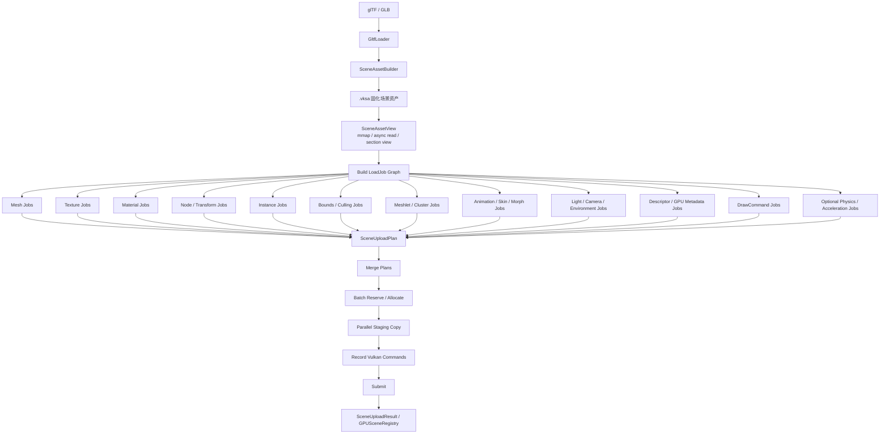

# 渐进式重构计划：SceneAsset 固化格式 + 并行 UploadPlan + 批量 GPU Commit

## 目标

当前目标不只是把 glTF 解析结果缓存下来，而是将 glTF 场景转换为一个引擎自定义、可快速读取、可并行处理、可直接面向 GPU 上传的固化场景资产格式。

核心目标：

1. **glTF 只解析一次**  
   首次加载时解析 glTF，并转换为自定义场景资产 `.vksa`。

2. **二次加载跳过 glTF 解析路径**  
   后续启动优先加载 `.vksa`，避免重复解析、转换、重排、展开。

3. **多资源并行准备**  
   不只并行 Mesh / Texture / Material，还要并行准备：
   - Node / Transform
   - Instance
   - Bounds / Culling
   - Meshlet / Cluster
   - Animation / Skin / Morph
   - Light / Camera / Environment
   - Descriptor / GPU Metadata
   - DrawCommand / IndirectCommand
   - Optional Physics / BVH / RayTracing Acceleration

4. **并行阶段生成 UploadPlan，而不是直接抢 GPU 资源**  
   多线程阶段只读 `SceneAssetView`，生成各种 `UploadPlan`。  
   最终由主线程或受控 Render Thread 统一：
   - reserve / allocate
   - staging copy
   - command buffer record
   - submit
   - 生成 `SceneUploadResult`

推荐核心流程：

```text
.vksa / SceneAssetView
  -> parallel build SceneUploadPlan
  -> merge plans
  -> batch reserve / allocate
  -> parallel staging memcpy
  -> record GPU upload commands
  -> submit
  -> SceneUploadResult / GPUSceneRegistry
```

---

## 总体架构



---

## 设计原则

### 1. SceneAsset 是运行时语义，VKSA 是稳定磁盘 ABI

不要把 `SceneAsset` 的 `std::vector`、`glm::vec3`、`bool`、`VkFormat` 等运行时结构直接写入磁盘作为 ABI。

推荐拆分：

```cpp
// 运行时结构
struct SceneMesh {
    uint64_t vertexByteOffset;
    uint64_t indexByteOffset;
    uint32_t vertexCount;
    uint32_t indexCount;
    uint32_t vertexStride;
    VkIndexType indexType;
    uint32_t materialIndex;
    glm::vec3 localBoundsMin;
    glm::vec3 localBoundsMax;
};

// 磁盘结构，使用 fixed-width 类型
struct VksaMeshRecord {
    uint64_t vertexByteOffset;
    uint64_t indexByteOffset;
    uint32_t vertexCount;
    uint32_t indexCount;
    uint32_t vertexStride;
    uint32_t indexType;
    uint32_t materialIndex;
    float localBoundsMin[3];
    float localBoundsMax[3];
    uint32_t flags;
};
```

磁盘格式建议：

- 固定整数宽度：`uint32_t` / `uint64_t`
- 不直接使用 `bool`
- 不直接使用 `glm::*`
- 不直接使用 `std::vector`
- 不依赖 C++ struct padding
- `VkFormat` 写为 `uint32_t`
- 所有 section 使用 offset + size
- 版本号严格校验
- 不兼容时 fallback 到 glTF

---

### 2. 并行阶段只读 SceneAssetView

多线程 job 只读：

```text
meshes section
textures section
materials section
nodes section
payload sections
```

不要在 job 内直接修改：

```text
MeshPool
TexturePool
DescriptorPool
BatchUploadContext
GPUSceneRegistry
Renderer global state
```

这些共享状态应在 `Merge Plans` 或 `Batch Commit` 阶段集中处理。

---

### 3. 并行阶段生成 UploadPlan

不要让每个线程直接调用：

```cpp
MeshPool::uploadMesh(...)
TexturePool::createTexture(...)
Renderer::createMaterial(...)
vkUpdateDescriptorSets(...)
```

推荐每个线程生成 plan：

```text
MeshUploadPlan
TextureUploadPlan
MaterialCreatePlan
TransformPlan
InstanceBuildPlan
CullRecordPlan
DescriptorUpdatePlan
DrawCommandPlan
```

最后统一汇总成：

```cpp
struct SceneUploadPlan {
    std::vector<MeshUploadPlan> meshes;
    std::vector<TextureUploadPlan> textures;
    std::vector<MaterialCreatePlan> materials;

    std::vector<SceneDrawInstance> instances;
    std::vector<InstanceCullRecord> cullRecords;
    std::vector<MeshletUploadPlan> meshlets;

    std::vector<GpuMaterialRecordPlan> gpuMaterials;
    std::vector<GpuInstanceRecordPlan> gpuInstances;
    std::vector<DrawCommandBuildPlan> drawCommands;

    std::vector<SkinUploadPlan> skins;
    std::vector<AnimationClipPlan> animations;
    std::vector<MorphTargetUploadPlan> morphTargets;

    std::vector<LightRecordPlan> lights;
    std::vector<CameraRecordPlan> cameras;
    std::vector<EnvironmentRecordPlan> environments;

    std::vector<PhysicsUploadPlan> physics;
    std::vector<AccelerationStructurePlan> accelerationStructures;
};
```

---

## VKSA 文件格式建议

### Header

```cpp
struct VksaHeader {
    char magic[8];               // "VKSA\0\0\0\0"
    uint32_t version;
    uint32_t flags;

    uint64_t sourcePathHash;
    uint64_t sourceContentHash;
    uint64_t sourceFileSize;
    uint64_t sourceWriteTime;

    uint32_t meshCount;
    uint32_t textureCount;
    uint32_t materialCount;
    uint32_t nodeCount;
    uint32_t nodeMeshRefCount;
    uint32_t rootNodeCount;
    uint32_t animationCount;
    uint32_t skinCount;
    uint32_t morphTargetCount;
    uint32_t lightCount;
    uint32_t cameraCount;

    uint32_t sectionCount;
    uint32_t reserved;
};
```

### Section Table

```cpp
enum class VksaSectionKind : uint32_t {
    MeshRecords,
    TextureRecords,
    MaterialRecords,
    NodeRecords,
    NodeMeshRefRecords,
    RootNodes,
    StringTable,

    VertexPayload,
    IndexPayload,
    TexturePayload,

    MeshletRecords,
    MeshletPayload,

    AnimationRecords,
    AnimationPayload,
    SkinRecords,
    MorphTargetRecords,
    MorphTargetPayload,

    LightRecords,
    CameraRecords,
    EnvironmentRecords,

    CollisionRecords,
    CollisionPayload,
    BvhPayload,
    RayTracingPayload
};

struct VksaSection {
    uint32_t kind;
    uint32_t flags;
    uint64_t fileOffset;
    uint64_t byteSize;
    uint64_t alignment;
};
```

### Texture Payload 类型

```cpp
enum class TexturePayloadKind : uint32_t {
    RawRgba8,
    Ktx2Container,
    BasisUniversal,
    GpuBlockCompressed
};

struct VksaTextureRecord {
    uint32_t width;
    uint32_t height;
    uint32_t depth;
    uint32_t mipLevels;
    uint32_t arrayLayers;
    uint32_t vkFormat;
    uint32_t payloadKind;
    uint32_t flags;
    uint64_t payloadOffset;
    uint64_t payloadSize;
};
```

`GpuBlockCompressed` 可以表示已经转成目标平台可上传格式，例如 BC7 / BC5 / ASTC 等。  
`Ktx2Container` / `BasisUniversal` 表示二次加载时仍需要解析或转码，但可在线程池并行处理。

---

## 核心运行时结构

### SceneAssetView

二次加载时优先使用只读 view：

```cpp
struct SceneAssetView {
    std::span<const SceneMesh> meshes;
    std::span<const SceneTexture> textures;
    std::span<const SceneMaterial> materials;
    std::span<const SceneNode> nodes;
    std::span<const SceneNodeMeshRef> nodeMeshRefs;
    std::span<const uint32_t> rootNodes;

    std::span<const std::byte> vertexPayload;
    std::span<const std::byte> indexPayload;
    std::span<const std::byte> texturePayload;

    std::span<const SceneMeshlet> meshlets;
    std::span<const std::byte> meshletPayload;

    std::span<const SceneAnimation> animations;
    std::span<const SceneSkin> skins;
    std::span<const SceneMorphTarget> morphTargets;

    std::span<const SceneLight> lights;
    std::span<const SceneCamera> cameras;
    std::span<const SceneEnvironment> environments;
};
```

### SceneNode 与 SceneNodeMeshRef

Mesh 不应该拥有 transform。  
Transform 属于 Node，Draw Instance 由 Node + MeshRef 展开得到。

```cpp
struct SceneNode {
    uint32_t nameOffset;

    int32_t parent;
    uint32_t childOffset;
    uint32_t childCount;

    uint32_t meshRefOffset;
    uint32_t meshRefCount;

    glm::vec3 translation;
    glm::quat rotation;
    glm::vec3 scale;
};

struct SceneNodeMeshRef {
    uint32_t nodeIndex;
    uint32_t meshIndex;
    uint32_t materialIndex;
};
```

### SceneDrawInstance

```cpp
struct SceneDrawInstance {
    uint32_t instanceIndex;
    uint32_t nodeIndex;
    uint32_t meshIndex;
    uint32_t materialIndex;
    glm::mat4 worldTransform;
};
```

---

## 并行 Job 分类

推荐不要只分为 Mesh / Texture / Material，而是使用更完整的 job 类型：

```cpp
enum class SceneLoadJobType {
    MeshPayload,
    TexturePayload,
    MaterialRecord,

    NodeTransform,
    InstanceBuild,
    BoundsBuild,

    MeshletPayload,

    AnimationPayload,
    SkinPayload,
    MorphTargetPayload,

    LightRecord,
    CameraRecord,
    EnvironmentRecord,

    DescriptorPlan,
    DrawCommandPlan,

    PhysicsPayload,
    AccelerationStructurePayload
};
```

---

## 各类并行任务设计

### 1. MeshPayload Job

职责：

- 读取 mesh metadata
- 计算 vertex / index slice
- 生成 mesh upload copy range
- 不直接调用 `MeshPool::uploadMesh`

```cpp
struct MeshUploadPlan {
    uint32_t meshIndex;

    uint64_t vertexSrcOffset;
    uint64_t vertexByteSize;
    uint64_t indexSrcOffset;
    uint64_t indexByteSize;

    uint64_t stagingVertexOffset;
    uint64_t stagingIndexOffset;

    uint32_t vertexCount;
    uint32_t indexCount;
    uint32_t vertexStride;
    VkIndexType indexType;

    glm::vec3 localBoundsMin;
    glm::vec3 localBoundsMax;
};
```

---

### 2. TexturePayload Job

职责：

- 读取 texture payload
- 判断 payload 类型
- 对 KTX2 / BasisU 执行 decode / transcode
- 生成 image upload plan
- 不直接修改 TexturePool / DescriptorPool

```cpp
struct MipCopyRange {
    uint32_t mipLevel;
    uint32_t width;
    uint32_t height;
    uint64_t srcOffset;
    uint64_t byteSize;
};

struct TextureUploadPlan {
    uint32_t textureIndex;
    VkFormat format;
    uint32_t width;
    uint32_t height;
    uint32_t mipLevels;
    TexturePayloadKind payloadKind;

    std::vector<MipCopyRange> mipCopies;

    // 如果需要 decode/transcode，由此对象持有临时解码结果
    DecodedTextureStorage decodedStorage;
};
```

---

### 3. MaterialRecord Job

职责：

- 读取 material factors
- 解析 texture refs
- 生成 material create plan
- 初步进行 alpha / opaque / transparent 分类

```cpp
struct MaterialCreatePlan {
    uint32_t materialIndex;

    glm::vec4 baseColorFactor;
    float metallicFactor;
    float roughnessFactor;
    float normalScale;
    float occlusionStrength;
    glm::vec3 emissiveFactor;

    int32_t baseColorTexture;
    int32_t normalTexture;
    int32_t metallicRoughnessTexture;
    int32_t occlusionTexture;
    int32_t emissiveTexture;

    uint32_t alphaMode;
    float alphaCutoff;
    uint32_t workflow;
};
```

---

### 4. NodeTransform Job

职责：

- 从 `SceneNode` 层级计算 world transform
- 使用 dirty 标记时只更新变化子树
- 二次加载时可以按 root subtree 并行

```cpp
struct TransformBuildPlan {
    std::vector<glm::mat4> worldTransforms;
};
```

注意：  
Node transform 是 instance 生成和 culling bounds 的基础，应早于 InstanceBuild / BoundsBuild 完成。

---

### 5. InstanceBuild Job

职责：

- 遍历 node mesh refs
- 展开 SceneDrawInstance
- 生成 renderer / GPU-driven 统一输入

```cpp
struct InstanceBuildPlan {
    std::vector<SceneDrawInstance> instances;
};
```

---

### 6. BoundsBuild Job

职责：

- 将 mesh local bounds 转换为 instance world bounds
- 生成 GPU culling record
- 生成 bounding sphere / AABB
- 可用于 CPU culling、GPU culling、LOD、cluster culling

```cpp
struct InstanceCullRecord {
    uint32_t instanceIndex;
    uint32_t meshIndex;

    glm::vec3 worldBoundsMin;
    glm::vec3 worldBoundsMax;
    glm::vec4 boundingSphere;
};
```

---

### 7. MeshletPayload Job

如果你的 GPUDrivenRenderer 有 meshlet / cluster culling，这类数据应该单独处理。

职责：

- 读取或生成 meshlet 数据
- 生成 meshlet upload ranges
- 生成 cluster culling metadata

```cpp
struct MeshletUploadPlan {
    uint32_t meshIndex;

    uint64_t meshletRecordOffset;
    uint64_t meshletRecordSize;

    uint64_t meshletVertexOffset;
    uint64_t meshletVertexSize;

    uint64_t meshletIndexOffset;
    uint64_t meshletIndexSize;
};
```

建议：  
如果 meshlet 构建开销明显，应在 `.vksa` 中固化 meshlet 数据，二次加载只做上传。

---

### 8. Animation / Skin / Morph Jobs

如果支持动画，应预留以下 section 和 job。

#### SkinPayload

```cpp
struct SkinUploadPlan {
    uint32_t skinIndex;
    uint32_t jointCount;
    uint64_t inverseBindMatrixOffset;
    uint64_t inverseBindMatrixSize;
};
```

#### AnimationPayload

```cpp
struct AnimationClipPlan {
    uint32_t animationIndex;
    uint32_t samplerOffset;
    uint32_t samplerCount;
    uint32_t channelOffset;
    uint32_t channelCount;
};
```

#### MorphTargetPayload

```cpp
struct MorphTargetUploadPlan {
    uint32_t meshIndex;
    uint32_t targetCount;
    uint64_t payloadOffset;
    uint64_t payloadSize;
};
```

这些数据可以和 Mesh / Texture 并行准备。

---

### 9. Light / Camera / Environment Jobs

职责：

- 准备 light records
- 准备 camera records
- 准备 environment / reflection probe / irradiance map refs
- 准备 shadow metadata

```cpp
struct LightRecordPlan {
    uint32_t lightIndex;
    uint32_t type;
    glm::vec3 color;
    float intensity;
    glm::vec3 position;
    float range;
    glm::vec3 direction;
    float coneAngle;
};

struct CameraRecordPlan {
    uint32_t cameraIndex;
    glm::mat4 view;
    glm::mat4 projection;
};

struct EnvironmentRecordPlan {
    uint32_t environmentIndex;
    int32_t environmentTexture;
    int32_t irradianceTexture;
    int32_t prefilteredTexture;
};
```

---

### 10. Descriptor / GPU Metadata Jobs

这一类经常被遗漏，但对二次加载速度很关键。  
它用于提前生成 GPU records，而不是在主线程临时查表。

职责：

- texture handle -> bindless index
- material index -> GPU material record
- instance index -> GPU instance record
- mesh handle -> GPU draw record
- descriptor update plan

```cpp
struct GpuMaterialRecordPlan {
    uint32_t materialIndex;

    uint32_t baseColorTextureIndex;
    uint32_t normalTextureIndex;
    uint32_t metallicRoughnessTextureIndex;
    uint32_t occlusionTextureIndex;
    uint32_t emissiveTextureIndex;

    glm::vec4 baseColorFactor;
    glm::vec4 metallicRoughnessNormalOcclusion;
    glm::vec4 emissiveAlpha;
};

struct GpuInstanceRecordPlan {
    uint32_t instanceIndex;
    uint32_t meshIndex;
    uint32_t materialIndex;
    glm::mat4 worldTransform;
};

struct DescriptorUpdatePlan {
    std::vector<GpuMaterialRecordPlan> gpuMaterials;
    std::vector<GpuInstanceRecordPlan> gpuInstances;
};
```

---

### 11. DrawCommand / IndirectCommand Jobs

如果是 GPU-driven renderer，可以提前生成初始 draw command 数据。

职责：

- 生成 opaque / alphaTest / transparent / shadowCaster 分组
- 生成 indirect draw command
- 生成 draw record / draw instance mapping

```cpp
struct DrawCommandBuildPlan {
    uint32_t instanceIndex;
    uint32_t meshIndex;
    uint32_t materialIndex;
    VkDrawIndexedIndirectCommand command;
};

struct DrawListPlan {
    std::vector<uint32_t> opaqueDraws;
    std::vector<uint32_t> alphaTestDraws;
    std::vector<uint32_t> transparentDraws;
    std::vector<uint32_t> shadowCasterDraws;
    std::vector<DrawCommandBuildPlan> commands;
};
```

---

### 12. Optional Physics / Acceleration Jobs

如果未来支持物理、拾取、BVH、Ray Tracing，可以预留：

```text
collisionMeshesSection
bvhSection
rayTracingBlasSection
navigationSection
```

对应 plan：

```cpp
struct PhysicsUploadPlan {
    uint32_t colliderIndex;
    uint64_t payloadOffset;
    uint64_t payloadSize;
};

struct AccelerationStructurePlan {
    uint32_t meshIndex;
    uint64_t blasPayloadOffset;
    uint64_t blasPayloadSize;
};
```

---

## 渐进式实施阶段

### Phase 0 — SceneAsset 语义边界整理

目标：

- 建立运行时 `SceneAsset` / `SceneAssetView`
- 明确 Mesh、Node、Instance、Material 的职责边界
- Mesh 不持有 transform
- Node 持有 local transform
- Instance 由 Node + MeshRef 展开得到

新增文件：

```text
scene/SceneAsset.h
scene/SceneAssetView.h
scene/SceneTypes.h
```

关键任务：

- 定义 `SceneMesh`
- 定义 `SceneTexture`
- 定义 `SceneMaterial`
- 定义 `SceneNode`
- 定义 `SceneNodeMeshRef`
- 定义 `SceneDrawInstance`
- 定义可选 `SceneAnimation` / `SceneSkin` / `SceneLight` 等占位结构

验证：

- 小型手写 SceneAsset 测试
- 验证多 mesh node
- 验证多个 node 引用同一个 mesh
- 验证 transform 不再属于 mesh

---

### Phase 0.5 — VKSA 磁盘格式 ABI

目标：

- 在 serializer 前先稳定 `.vksa` 文件格式
- 定义 header / section table / fixed-width record
- 避免直接持久化运行时结构

新增文件：

```text
scene/VksaFormat.h
```

关键任务：

- 定义 `VksaHeader`
- 定义 `VksaSection`
- 定义 `VksaMeshRecord`
- 定义 `VksaTextureRecord`
- 定义 `VksaMaterialRecord`
- 定义 `VksaNodeRecord`
- 定义 `VksaNodeMeshRefRecord`
- 定义 `VksaSectionKind`
- 定义版本兼容策略

验证：

- static_assert record size
- alignment 检查
- endian / version 检查
- section offset / size 检查

---

### Phase 1 — SceneAssetBuilder：glTF -> SceneAsset

目标：

- 首次加载 glTF 后转换为引擎自定义场景数据
- 保留渲染所需的稳定语义
- 为二次加载和并行准备建立基础

新增文件：

```text
scene/SceneAssetBuilder.h
scene/SceneAssetBuilder.cpp
```

关键任务：

- GltfModel meshes -> SceneMesh
- GltfModel materials -> SceneMaterial
- GltfModel images/textures -> SceneTexture
- GltfModel nodes -> SceneNode / SceneNodeMeshRef
- 构建 interleaved vertex payload
- 构建 index payload
- 复制或转换 texture payload
- 生成 local bounds
- 可选生成 meshlet / animation / skin / light 数据

验证：

- mesh count 一致
- material count 一致
- texture count 一致
- node hierarchy 一致
- vertex/index payload byte-for-byte round-trip
- material texture refs 正确
- alpha mode 分类输入正确

---

### Phase 2 — SceneAssetSerializer / VKSA 读写

目标：

- 实现 `.vksa` 保存与读取
- 支持从 `.vksa` 建立 `SceneAssetView`
- 与旧 `.vkcache` 共存

新增文件：

```text
scene/SceneAssetSerializer.h
scene/SceneAssetSerializer.cpp
scene/VksaReader.h
scene/VksaReader.cpp
scene/VksaWriter.h
scene/VksaWriter.cpp
```

关键任务：

- `save(path, SceneAsset)`
- `load(path, SceneAsset)`
- `map(path, SceneAssetView)`
- `isValid(vksaPath, sourceGltfPath)`
- 校验 source hash / size / write time
- 校验 external buffers / textures 依赖
- 不兼容时 fallback 到 glTF

验证：

- SceneAsset -> .vksa -> SceneAsset round-trip
- header / section table 校验
- source glTF 修改后 cache 失效
- 外部 .bin / texture 修改后 cache 失效
- corrupted file fallback

---

### Phase 3 — SceneUploadPlan 与 Job Graph

目标：

- 引入统一的上传计划层
- 多线程阶段不直接修改渲染资源
- 所有并行任务产出 plan

新增文件：

```text
scene/SceneUploadPlan.h
scene/SceneLoadJob.h
scene/SceneLoadJobGraph.h
scene/SceneUploadPlanner.h
scene/SceneUploadPlanner.cpp
```

关键任务：

- 定义 `SceneLoadJobType`
- 定义 `MeshUploadPlan`
- 定义 `TextureUploadPlan`
- 定义 `MaterialCreatePlan`
- 定义 `TransformBuildPlan`
- 定义 `InstanceBuildPlan`
- 定义 `InstanceCullRecord`
- 定义 `DescriptorUpdatePlan`
- 定义 `DrawListPlan`
- 构建 job dependency graph

依赖关系示例：

```text
NodeTransform -> InstanceBuild -> BoundsBuild
TexturePayload -> MaterialRecord -> DescriptorPlan
MeshPayload -> DrawCommandPlan
MaterialRecord -> DrawCommandPlan
InstanceBuild -> DrawCommandPlan
```

验证：

- Job graph 拓扑排序正确
- 单线程执行 plan 与旧路径结果一致
- 多线程执行 plan 与单线程结果一致

---

### Phase 4 — MeshPool 解耦

目标：

- MeshPool 不再依赖 `GltfMeshData`
- Mesh 上传消费 `MeshUploadPlan` 或 `SceneMeshUploadData`
- 旧路径保留并适配新路径

修改文件：

```text
render/MeshPool.h
render/MeshPool.cpp
```

关键任务：

- 新增 `SceneMeshUploadData`
- 新增 `uploadMesh(const SceneMeshUploadData&, ...)`
- 旧 `uploadMesh(const GltfMeshData&, ...)` 内部转换到新路径
- 移除 MeshPool 对 transform / material 的依赖
- 明确 vertexStride / indexType / byte offsets

验证：

- 同一 mesh 旧路径与新路径 GPU buffer 内容一致
- uint16 / uint32 index 测试
- 不同 vertex stride 测试
- 多 mesh batch 测试

---

### Phase 5 — Texture Upload 解耦

目标：

- Texture 上传从 glTF image 数据中解耦
- TexturePool 消费 `TextureUploadPlan`
- 支持 KTX2 / BasisU / Raw / GPU compressed payload

修改文件：

```text
render/TexturePool.h
render/TexturePool.cpp
render/TextureUploader.h
render/TextureUploader.cpp
```

关键任务：

- 新增 `uploadTexture(const TextureUploadPlan&, ...)`
- KTX2/BasisU decode/transcode 可在线程池完成
- GPU-ready payload 直接生成 copy regions
- 支持 mip copy ranges
- 纹理 descriptor 更新与 image 创建解耦

验证：

- Raw RGBA8 上传一致
- KTX2 上传一致
- BasisU 转码一致
- mip levels 正确
- sRGB / linear format 正确

---

### Phase 6 — Material / Descriptor / GPU Metadata 解耦

目标：

- Material 创建不再依赖 `GltfMaterialData`
- 提前生成 GPU material / instance records
- Descriptor 更新由 plan 驱动

修改文件：

```text
render/MaterialSystem.h
render/MaterialSystem.cpp
render/DescriptorManager.h
render/DescriptorManager.cpp
```

关键任务：

- 新增 `createMaterial(const MaterialCreatePlan&)`
- 新增 `applyDescriptorUpdatePlan(...)`
- 建立 texture index -> bindless index 映射
- 建立 material index -> GPU material record 映射
- 建立 instance index -> GPU instance record 映射

验证：

- material 参数一致
- texture refs 一致
- alpha 分类一致
- descriptor 数量一致
- bindless index 映射一致

---

### Phase 7 — Renderer 支持 SceneUploadPlan Commit

目标：

- Renderer 不直接从 GltfModel 上传
- Renderer 支持提交 `SceneUploadPlan`
- 旧 `uploadGltfModel` 与新路径共存

修改文件：

```text
render/Renderer.h
render/Renderer.cpp
```

新增接口：

```cpp
SceneUploadResult Renderer::commitSceneUploadPlan(
    const SceneAssetView& asset,
    const SceneUploadPlan& plan,
    VkCommandBuffer cmd
);
```

关键任务：

- 消费 MeshUploadPlan
- 消费 TextureUploadPlan
- 消费 MaterialCreatePlan
- 消费 DescriptorUpdatePlan
- 消费 DrawListPlan
- 生成 `SceneUploadResult`

验证：

- `uploadGltfModel` 与 `commitSceneUploadPlan` handle 映射一致
- opaque / alphaTest / transparent / shadowCaster 分类一致
- GPU buffer 内容一致
- descriptor 内容一致

---

### Phase 8 — GPUDrivenRenderer 适配

目标：

- GPUDrivenRenderer 不再依赖 `GltfModel`
- 改为消费 `SceneAssetView + SceneUploadResult + SceneUploadPlan`

修改文件：

```text
render/GPUDrivenRenderer.h
render/GPUDrivenRenderer.cpp
```

新增接口：

```cpp
void GPUDrivenRenderer::rebuildGPUDrivenScene(
    const SceneAssetView& asset,
    const SceneUploadPlan& plan,
    const SceneUploadResult& result,
    VkCommandBuffer cmd
);
```

关键任务：

- 使用 `SceneDrawInstance`
- 使用 `InstanceCullRecord`
- 使用 `DrawCommandBuildPlan`
- 使用 meshlet / cluster 数据
- 更新 GPUSceneRegistry

验证：

- object count 一致
- visible count 一致
- cull stats 一致
- draw command 数量一致
- GPU-driven diagnostics 与旧路径一致

---

### Phase 9 — AsyncLoadingCoordinator 基于 SceneUploadPlan

目标：

- Coordinator 以 `SceneAssetView` 和 `SceneUploadPlan` 为基础拆分 batch
- 支持优先级、预算、流式加载

修改文件：

```text
render/AsyncLoadingCoordinator.h
render/AsyncLoadingCoordinator.cpp
```

关键任务：

- `begin(const SceneAssetView&, const SceneUploadPlan&)`
- 按 mesh / texture / instance / draw command 拆 batch
- 预算估算直接来自 plan
- 支持 near camera priority
- 支持 texture 优先级
- 支持 progressive upload

验证：

- batch 顺序稳定
- budget 生效
- 单线程 / 多线程结果一致
- progressive loading 没有 handle 错配

---

### Phase 10 — ParallelSceneLoader

目标：

- 实现真正的多线程准备阶段
- 并行执行 job graph
- 统一生成 `SceneUploadPlan`

新增文件：

```text
scene/ParallelSceneLoader.h
scene/ParallelSceneLoader.cpp
scene/SceneJobSystem.h
scene/SceneJobSystem.cpp
```

关键任务：

- mmap / async read `.vksa`
- 生成 job graph
- 线程池执行 job
- job 只读 `SceneAssetView`
- 输出 `SceneUploadPlan`
- 处理 job dependency
- 支持取消加载
- 支持加载进度统计
- 支持错误 fallback

推荐执行模型：

```text
1. map SceneAssetView
2. build job graph
3. parallel prepare
4. merge plans
5. renderer commit
```

验证：

- 多线程结果与单线程一致
- 不同线程数结果一致
- 可取消加载
- 失败 fallback 到 glTF
- CPU 占用合理
- 内存峰值可控

---

### Phase 11 — BatchUploadContext 并行 staging 支持

目标：

- 支持并行 memcpy 到 staging slice
- 避免多线程抢 `allocate()`
- 先 reserve 总大小，再分 slice

修改文件：

```text
render/BatchUploadContext.h
render/BatchUploadContext.cpp
```

关键任务：

- 预计算总 staging bytes
- 一次性或少量几次 allocate
- 分配 thread-local staging slices
- 多线程 memcpy
- 最终统一 record copy commands

验证：

- staging offset 不重叠
- memory alignment 正确
- 多线程 memcpy 结果正确
- Vulkan validation layer 无错误

---

### Phase 12 — TransformSystem 抽离

目标：

- 从 App 层抽离 node transform 传播
- 支持 dirty update
- 支持二次加载时并行 world transform 计算

新增文件：

```text
scene/TransformSystem.h
scene/TransformSystem.cpp
```

关键任务：

- local -> world transform
- dirty subtree propagation
- 输出 world transform array
- 输出 changed instance list
- 对接 GPUSceneRegistry

验证：

- hierarchy transform 正确
- 修改局部节点后子树更新正确
- GPU culling record 更新正确
- App 层逻辑减少

---

### Phase 13 — MinimalLatestApp 切换主路径

目标：

- App 主持有对象从 `GltfModel` 切换为 `SceneAssetView / SceneAsset`
- glTF 只作为首次构建 `.vksa` 的源数据

修改文件：

```text
app/MinimalLatestApp.h
app/MinimalLatestApp.cpp
```

改动策略：

```cpp
std::optional<demo::SceneAsset> m_sceneAsset;
std::optional<demo::SceneAssetView> m_sceneAssetView;
std::optional<demo::SceneUploadPlan> m_sceneUploadPlan;
std::optional<demo::SceneUploadResult> m_currentSceneResult;

// 仅首次生成 .vksa 时存在
std::optional<demo::GltfModel> m_sourceGltfModel;
```

关键任务：

- `loadModelAsync()` 优先读取 `.vksa`
- 无效时 fallback 到 glTF
- glTF -> SceneAsset -> .vksa
- `.vksa` -> ParallelSceneLoader -> SceneUploadPlan
- Renderer commit SceneUploadPlan
- GPUDrivenRenderer rebuild

验证：

- 首次加载正常
- 二次加载走 `.vksa`
- fallback 正常
- UI scene graph 正常
- transform 编辑正常
- async loading 正常

---

### Phase 14 — 旧路径清理

目标：

- SceneAsset 路径稳定后移除直接渲染 glTF 的旧路径
- 保留 GltfLoader 作为 `.gltf -> .vksa` 导入器

可清理：

```text
Renderer::uploadGltfModel()
Renderer::uploadGltfModelBatch()
GPUDrivenRenderer::rebuildGPUDrivenScene(const GltfModel&, ...)
AsyncLoadingCoordinator::begin(const GltfModel&, ...)
MinimalLatestApp::m_sceneModel
SceneCacheSerializer
```

保留：

```text
GltfLoader
SceneAssetBuilder
SceneAssetSerializer
VksaReader / VksaWriter
```

---

## 推荐优先级

| 优先级 | 数据类别 | 原因 |
|---|---|---|
| P0 | MeshPayload | 顶点/索引数据最大，必须优化 |
| P0 | TexturePayload | 通常最耗 I/O 和 decode/transcode |
| P0 | MaterialRecord | 绑定 texture / alpha 分类必需 |
| P0 | NodeTransform | 生成 instance 的基础 |
| P0 | InstanceBuild | Renderer / GPUDrivenRenderer 的统一输入 |
| P1 | BoundsBuild | GPU culling / LOD 必需 |
| P1 | DescriptorPlan | 避免主线程集中查表和映射 |
| P1 | DrawCommandPlan | GPU-driven 渲染收益明显 |
| P2 | MeshletPayload | 如果有 cluster culling，就非常重要 |
| P2 | Animation / Skin / Morph | 有动画场景时重要 |
| P3 | Light / Camera / Environment | 通常轻量，但应纳入统一格式 |
| P3 | Physics / BLAS / BVH | 根据引擎功能需求决定 |

---

## 风险与缓解

| 风险 | 说明 | 缓解 |
|---|---|---|
| 直接持久化运行时结构 | padding / alignment / ABI 不稳定 | 使用 fixed-width VKSA record |
| MeshPool reserve 非线程安全 | 多线程同时修改 shared arena | 先生成 plan，统一 reserve |
| BatchUploadContext allocate 非线程安全 | 多线程抢 staging allocation | 预计算总大小，分配 staging slices |
| Vulkan descriptor 更新并发风险 | pool / set / layout 管理复杂 | 生成 DescriptorUpdatePlan，集中更新 |
| Texture decode 内存峰值高 | KTX2 / BasisU 并发转码可能爆内存 | 限制 texture worker 数量 |
| Meshlet 构建耗时 | 二次加载仍然 CPU 热点 | 尽量固化 meshlet payload |
| cache invalidation 不完整 | 外部 .bin / texture 修改未失效 | 记录依赖文件 hash |
| job dependency 出错 | plan 顺序不稳定或数据缺失 | 使用明确 job graph 和拓扑排序 |
| 多线程结果不确定 | handle 映射顺序不稳定 | plan 中保留原始 index，commit 阶段稳定映射 |
| fallback 复杂 | 新格式读取失败可能影响加载 | 每阶段保留 glTF fallback |

---

## 验证计划

### 1. SceneAsset 语义验证

- Mesh 不持有 transform
- Node 持有 local transform
- NodeMeshRef 正确
- SceneDrawInstance 正确展开
- 多 mesh node 正确
- 多 node 引用同一 mesh 正确

### 2. VKSA Round-trip 验证

- `SceneAsset -> .vksa -> SceneAsset`
- mesh count 一致
- material count 一致
- texture count 一致
- node hierarchy 一致
- vertex payload byte-for-byte 一致
- index payload byte-for-byte 一致
- texture metadata 一致

### 3. Cache Invalidation 验证

- 修改 glTF 主文件后失效
- 修改外部 `.bin` 后失效
- 修改外部 texture 后失效
- 修改 KTX2 后失效
- corrupted `.vksa` fallback

### 4. UploadPlan 验证

- 单线程 plan 与旧路径一致
- 多线程 plan 与单线程一致
- job order 改变不影响最终结果
- handle mapping 稳定
- alpha / opaque / transparent 分类一致

### 5. GPU Buffer 验证

- vertex buffer 内容一致
- index buffer 内容一致
- material buffer 内容一致
- instance buffer 内容一致
- indirect draw command 内容一致
- descriptor 内容一致

### 6. GPUDriven 验证

- object count 一致
- visible count 一致
- cull stats 一致
- draw count 一致
- meshlet / cluster count 一致
- diagnostics panel 一致

### 7. 性能验证

对比：

```text
首次 glTF 加载
二次 .vksa 单线程加载
二次 .vksa 多线程加载
二次 .vksa progressive loading
```

指标：

```text
总加载耗时
CPU parse / prepare 时间
texture decode 时间
GPU upload 时间
main thread stall 时间
内存峰值
staging buffer 峰值
首帧可见时间
```

---

## 推荐第一阶段落地顺序

为了避免一次性改太大，建议先做以下最小闭环：

```text
Step 1: SceneAsset / SceneAssetView 语义整理
Step 2: VKSA Header + Section Table + Mesh/Texture/Material/Node records
Step 3: SceneAssetBuilder
Step 4: SceneAssetSerializer round-trip
Step 5: SceneUploadPlan 定义
Step 6: 单线程 SceneUploadPlanner
Step 7: Renderer commit SceneUploadPlan
Step 8: ParallelSceneLoader 多线程化
```

先把 **单线程 UploadPlan 闭环** 跑通，再做真正的多线程。  
这样可以把架构风险和并发风险分开处理。

---

## 最终结论

新的重构目标应该从：

```text
并行加载 Mesh / Texture / Material
```

升级为：

```text
并行构建完整 GPU Scene 的 SceneUploadPlan
```

最终结构：

```text
SceneAssetView
  -> SceneLoadJobGraph
  -> parallel SceneUploadPlan
  -> batch GPU commit
  -> SceneUploadResult
  -> GPUSceneRegistry
```

这样不仅可以优化第二次加载 glTF 场景的速度，也能为后续 streaming、progressive loading、GPU-driven rendering、meshlet culling、ray tracing acceleration、scene editing 留出足够扩展空间。
